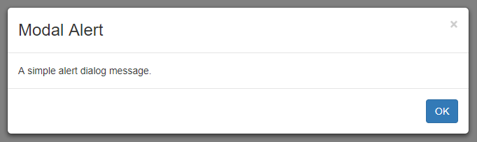
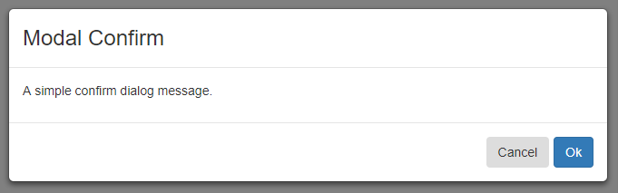
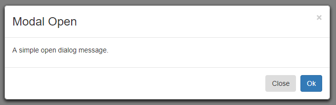

# Angular modal dialog example

>### This application is generated with:
* [Angular CLI](https://github.com/angular/angular-cli) `version 1.6.0`

>### Key Functionality:
* Dialog Modal with [ngx-modialog](https://github.com/shlomiassaf/ngx-modialog)

## Running the Application
1. Run `npm install`
1. Run `ng serve`
1. Go to http://localhost:4200/ in your browser 

## Screenshots

  

  

